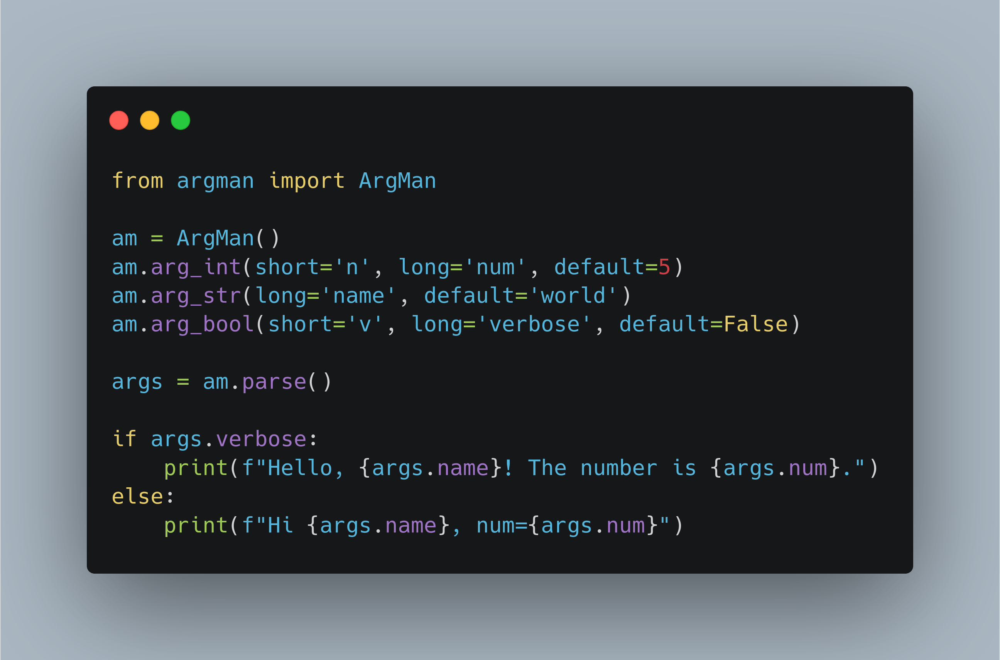

# ArgMan

A lightweight, zero-dependency argument parser for Python CLI tools — simple, testable, and intuitive.


---

## Features

- Short (`-v`) and long (`--verbose`) flags
- Type-safe parsing: `int`, `float`, `str`, `bool`, `list`
- Default values and boolean toggles
- Repeated arguments with `arg_list`
- Positional arguments
- Automatic `--no-flag` for booleans
- `--arg=value` and `--` terminator support
- Clean help and error messages

---

## Documentation

Usage examples and API reference: [docs/](docs/)

---

## Installation

You can install __ArgMan__ directly from [PyPi](https://pypi.org/project/argman/):

```shell
pip install argman
```

## Running Tests

```bash
python -m unittest discover tests
```

## Roadmap

v0.1 — Core Functionality

- [x] Complete

v0.2 — Extended Features

- [x] arg_list, --no-flag, --arg=value, -- support
- [ ] Custom error messages, config files, subcommands

v0.3 — Docs & Publish

- [x] Docs ready
- [x] Publish to PyPI

v0.4 — Validation & Customization

- [ ] Validators, formatters, dependencies, custom handlers

## License

LGPL-3.0 © 2025